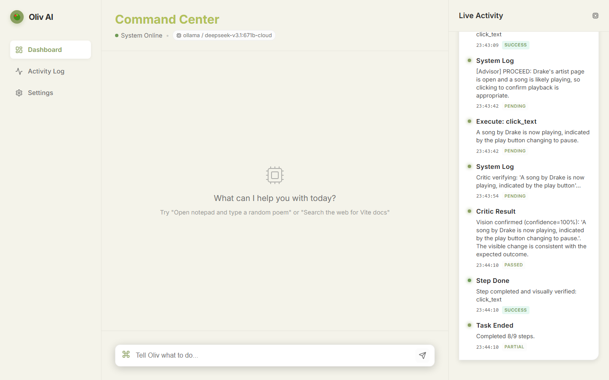
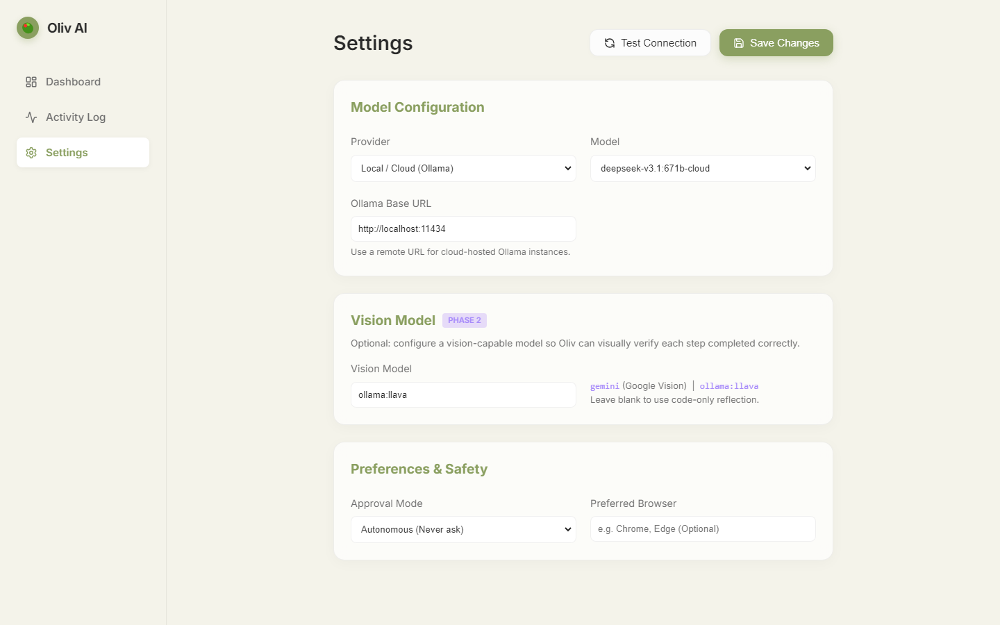

<p align="center">
  
  
  
  
</p>

<h1 align="center">🫒 Oliv AI</h1>

<p align="center">
  <strong>An autonomous AI agent that controls your Windows desktop — clicks, types, browses, and thinks for you.</strong>
</p>

<p align="center">
  Point-and-shoot task automation powered by local LLMs (Ollama) or Google Gemini.<br/>
  No cloud lock-in. No API keys required. Just describe what you want done.
</p>

---

## ✨ What is Oliv AI?



Oliv AI is an **autonomous desktop agent** for Windows. You give it a natural language command — like *"open Chrome and search for flights to Tokyo"* or *"create a new folder on the desktop called Projects"* — and it plans, executes, and verifies each step by actually controlling your mouse, keyboard, and applications.

Unlike chatbots that just generate text, Oliv **takes real action** on your computer:

- 🖱️ **Clicks buttons, links, and UI elements** by reading screen text
- ⌨️ **Types into text fields, search bars, and terminals**
- 🌐 **Navigates browsers** — opens URLs, clicks through pages, fills forms
- 📁 **Manages files** — creates, reads, writes, and organizes files & folders
- 🧠 **Thinks adaptively** — replans on failure, retries with alternatives, knows when to stop
- 👁️ **Sees your screen** — visual verification confirms each step actually worked
- 🔒 **Safety-first** — configurable approval modes from fully supervised to autonomous

## 🏗️ Architecture

Oliv AI uses a sophisticated multi-agent architecture with a Plan → Execute → Reflect → Verify loop:

```
User Command
     │
     ▼
┌─────────────────┐
│  Intent Parser   │  ← Understands what the user wants
└────────┬────────┘
         ▼
┌─────────────────┐
│    Planner       │  ← Generates step-by-step execution plan
└────────┬────────┘       (injects live screen context via OCR/UIA)
         ▼
┌─────────────────────────────────────────────────┐
│              Execution Loop (per step)           │
│                                                  │
│   ┌──────────┐   ┌───────────┐   ┌──────────┐  │
│   │ Executor  │──▶│ Reflector │──▶│  Critic  │  │
│   │(runs tool)│   │(code check)│   │(vision)  │  │
│   └──────────┘   └───────────┘   └──────────┘  │
│         │                              │         │
│         ▼                              ▼         │
│   ┌──────────┐                  ┌──────────┐    │
│   │ FixAgent │  ← on failure    │ Advisor  │    │
│   │(alt step)│                  │(next step)│    │
│   └──────────┘                  └──────────┘    │
└─────────────────────────────────────────────────┘
         │
         ▼
    Task Complete
   (with memory)
```

### Core Components

| Component | File | Role |
|-----------|------|------|
| **Agent Loop** | `backend/agent/loop.py` | Core orchestration — runs the plan→execute→reflect→verify cycle |
| **Intent Parser** | `backend/agent/intent_parser.py` | Extracts structured intent from natural language |
| **Planner** | `backend/agent/planner.py` | Generates step-by-step tool-call plans with screen awareness |
| **Executor** | `backend/agent/executor.py` | Runs individual tool calls with a 30s hard timeout |
| **Reflector** | `backend/agent/reflector.py` | Code-level verification of tool execution results |
| **Critic** | `backend/agent/critic.py` | Vision-based screenshot verification (before/after diff) |
| **Step Advisor** | `backend/agent/step_advisor.py` | Thinks after each step — proceed, skip, adapt, replan, or done |
| **Fix Agent** | `backend/agent/loop.py` | Generates alternative steps when a planned step fails |
| **LLM Router** | `backend/llm/router.py` | Task-aware model routing (fast/smart/vision tiers) |

### Tool Modules

| Tool Module | Capabilities |
|-------------|-------------|
| **Screen Tools** | `click_text`, `read_screen`, `wait_for_text`, `find_text_coords`, `scroll` — OCR + UIA powered screen interaction |
| **Input Tools** | `type_text`, `press_key`, `hotkey` — Unicode-safe keyboard input |
| **Browser Tools** | `open_url`, `browser_click`, `browser_type`, `browser_read` — Playwright-based web automation |
| **File Tools** | `read_file`, `write_file`, `list_dir`, `create_dir` — File system operations |
| **System Tools** | `open_app`, `run_command`, `list_running_apps`, `is_app_running` — OS-level control |
| **Window Tools** | `focus_window`, `set_foreground`, `list_windows` — Window management via Win32 API |
| **Clipboard Tools** | `copy_to_clipboard`, `paste_from_clipboard` — Clipboard operations |

### LLM Routing Strategy

The router splits work across model tiers to balance speed and intelligence:

| Tier | Task Types | Default (Ollama) | Gemini Mode |
|------|-----------|-------------------|-------------|
| **Fast** | Intent parsing, Step Advisor | Local Ollama model | Ollama (saves quota) |
| **Smart** | Planning, FixAgent, Replan | Local Ollama model | Gemini Flash |
| **Vision** | Critic verification | Local Ollama model | Gemini Flash |

## 🚀 Getting Started

### Prerequisites

- **Windows 10/11** (required — uses Win32 APIs, UIAutomation, and pyautogui)
- **Python 3.11+**
- **Node.js 18+**
- **Ollama** (recommended) — [Download here](https://ollama.com/download)

### 1. Clone the Repository

```bash
git clone https://github.com/Yashkush06/oliv-ai.git
cd oliv-ai
```

### 2. Set Up the Backend

```powershell
cd backend

# Create virtual environment
python -m venv .venv
.\.venv\Scripts\Activate.ps1

# Install dependencies
pip install -r requirements.txt

# Install Playwright browsers (for web automation)
playwright install chromium
```

### 3. Set Up the Frontend

```powershell
cd frontend
npm install
```

### 4. Pull an Ollama Model

```bash
# Recommended: fast and capable
ollama pull qwen2.5:7b

# For vision tasks (optional)
ollama pull llava
```

### 5. Start Oliv AI

**Option A: One-click start (recommended)**
```powershell
# From the project root
.\start.ps1
```

**Option B: Manual start**
```powershell
# Terminal 1 — Backend
cd backend
.\.venv\Scripts\python.exe -m uvicorn main:app --host 127.0.0.1 --port 8000 --reload

# Terminal 2 — Frontend
cd frontend
npm run dev
```

### 6. Open the Dashboard

Navigate to **http://localhost:5173** — the Setup Wizard will guide you through:
1. **Choose Provider** — Ollama (local, free) or Google Gemini (cloud, free tier)
2. **Select Model** — Pick from your installed Ollama models
3. **Set Approval Mode** — Safe, Smart, or Autonomous

## ⚙️ Configuration



Configuration is stored at `~/.oliv-ai/config.json` and managed through the Settings page.

### LLM Providers

<details>
<summary><strong>Ollama (Local — Recommended)</strong></summary>

- **Cost:** Free
- **Privacy:** 100% local, no data leaves your machine
- **Setup:** Install Ollama → pull a model → select in wizard
- **Recommended models:** `qwen2.5:7b`, `llama3:8b`, `mistral:7b`
- **For vision:** Pull `llava` alongside your primary model

</details>

<details>
<summary><strong>Google Gemini (Cloud)</strong></summary>

- **Cost:** Free tier available (with rate limits)
- **Setup:** Get API key from [aistudio.google.com/apikey](https://aistudio.google.com/apikey)
- **Models:** `gemini-2.0-flash` (recommended), `gemini-2.5-pro-preview` (best quality)
- **Advantage:** Superior vision capabilities, faster for complex planning

</details>

### Approval Modes

| Mode | Behavior |
|------|----------|
| 🛡️ **Safe** | Asks permission before **every** action |
| ⚡ **Smart** (default) | Autonomous for safe tasks (read, browse), asks before risky actions (shell, delete) |
| 🤖 **Autonomous** | Never asks — fully autonomous execution |

## 📁 Project Structure

```
oliv-ai/
├── backend/                    # Python FastAPI server
│   ├── agent/                  # Core agent modules
│   │   ├── loop.py             # Main orchestration loop
│   │   ├── planner.py          # Step-by-step plan generation
│   │   ├── executor.py         # Tool execution with timeout
│   │   ├── critic.py           # Vision-based verification
│   │   ├── reflector.py        # Code-level result validation
│   │   ├── step_advisor.py     # Adaptive next-step reasoning
│   │   ├── intent_parser.py    # NL → structured intent
│   │   └── constants.py        # Shared config constants
│   ├── llm/                    # LLM client abstraction
│   │   ├── router.py           # Task-aware model routing
│   │   ├── ollama_client.py    # Ollama API client
│   │   ├── gemini_client.py    # Google Gemini client
│   │   └── api_client.py       # OpenAI-compatible client
│   ├── tools/                  # Agent tool implementations
│   │   ├── registry.py         # Decorator-based tool registration
│   │   ├── screen_tools.py     # OCR + UIA screen interaction
│   │   ├── input_tools.py      # Keyboard & mouse input
│   │   ├── browser_tools.py    # Playwright web automation
│   │   ├── file_tools.py       # File system operations
│   │   ├── system_tools.py     # App launch, process management
│   │   ├── window_tools.py     # Win32 window management
│   │   ├── clipboard_tools.py  # Clipboard operations
│   │   └── safety.py           # Risk assessment & gating
│   ├── perception/             # Screen understanding
│   │   ├── screenshot.py       # Screen capture utilities
│   │   └── describe_screen.py  # OCR + UIA screen reading
│   ├── memory/                 # Task memory & learning
│   │   ├── store.py            # Persistent task memory
│   │   └── preference_learner.py # Learns from user corrections
│   ├── config/                 # Configuration management
│   │   ├── manager.py          # Config load/save/merge
│   │   └── resolver.py         # Config path resolution
│   ├── utils/                  # Shared utilities
│   │   ├── logger.py           # Structured logging
│   │   └── ui_automation.py    # UIAutomation helpers
│   ├── main.py                 # FastAPI entry point + WebSocket
│   └── requirements.txt        # Python dependencies
├── frontend/                   # React + Vite dashboard
│   ├── src/
│   │   ├── pages/
│   │   │   ├── Dashboard.jsx   # Main command center
│   │   │   ├── SetupWizard.jsx # First-time setup flow
│   │   │   ├── Settings.jsx    # Configuration management
│   │   │   └── ActivityLog.jsx # Task history viewer
│   │   ├── components/
│   │   │   ├── StepProgress.jsx    # Step-by-step progress UI
│   │   │   ├── ApprovalModal.jsx   # Action confirmation dialog
│   │   │   └── PlanConfirmModal.jsx # Plan review dialog
│   │   ├── hooks/
│   │   │   ├── useApi.js       # API request hook
│   │   │   └── useWebSocket.js # Real-time event streaming
│   │   ├── App.jsx             # Root app with routing
│   │   └── main.jsx            # Entry point
│   └── package.json
├── start.ps1                   # One-click start script
├── .gitignore
└── README.md
```

## 🔌 API Reference

The backend exposes a REST + WebSocket API:

### REST Endpoints

| Method | Endpoint | Description |
|--------|----------|-------------|
| `GET` | `/api/health` | Health check + agent status |
| `POST` | `/api/chat` | Start a new task |
| `POST` | `/api/stop` | Stop the running task |
| `POST` | `/api/confirm` | Confirm/deny a pending action |
| `POST` | `/api/answer` | Answer a disambiguation prompt |
| `GET` | `/api/config` | Get current configuration |
| `PUT` | `/api/config` | Update configuration (hot-reloads LLM router) |
| `POST` | `/api/config/test-connection` | Test LLM provider connection |
| `GET` | `/api/ollama/models` | List available Ollama models |
| `GET` | `/api/logs` | Get recent activity logs |
| `GET` | `/api/memory` | Get task memory history |
| `GET` | `/api/tools` | List all registered tools |

### WebSocket

Connect to `ws://localhost:8000/ws/stream` for real-time events:

```json
{ "type": "step_start",   "task_id": "abc123", "tool": "click_text", "args": {"text": "Submit"} }
{ "type": "step_done",    "task_id": "abc123", "status": "success", "message": "..." }
{ "type": "critic_result", "task_id": "abc123", "status": "passed", "message": "Visual check OK" }
{ "type": "ask_user",     "task_id": "abc123", "message": "Confirm action: delete file?" }
{ "type": "task_done",    "task_id": "abc123", "status": "success", "message": "3/3 steps done" }
```

## 🛠️ Adding Custom Tools

Create a new file in `backend/tools/` and use the `@tool` decorator:

```python
# backend/tools/my_tools.py
from tools.registry import tool

@tool(
    name="my_custom_tool",
    description="Does something useful",
    parameters={
        "input": {"type": "string", "description": "What to process", "required": True}
    },
    risk_level="safe"  # "safe" | "moderate" | "dangerous"
)
def my_custom_tool(input: str) -> dict:
    # Your logic here
    result = process(input)
    return {"success": True, "result": result}
```

Tools are auto-discovered on startup — just import the module in `backend/tools/__init__.py`.

## 🧪 Example Commands

```
"Open Chrome and go to github.com"
"Create a new folder called 'Meeting Notes' on the Desktop"
"Type 'Hello World' in Notepad"
"Search for weather in Mumbai on Google"
"Open Task Manager and tell me what's using the most CPU"
"Take a screenshot"
"Close all Chrome windows"
```

## 🤝 Contributing

1. Fork the repository
2. Create your feature branch (`git checkout -b feature/amazing-feature`)
3. Commit your changes (`git commit -m 'Add amazing feature'`)
4. Push to the branch (`git push origin feature/amazing-feature`)
5. Open a Pull Request

## 📄 License

This project is licensed under the MIT License — see the [LICENSE](LICENSE) file for details.

## ⚠️ Disclaimer

Oliv AI controls your mouse, keyboard, and applications. While it has safety mechanisms (approval modes, risk assessment, blocked tool patterns), **use autonomous mode at your own risk**. Always start with Safe or Smart mode until you're comfortable with the agent's behavior.

---

<p align="center">
  Built with ❤️ by <a href="https://github.com/YourUsername">Yash</a>
</p>
